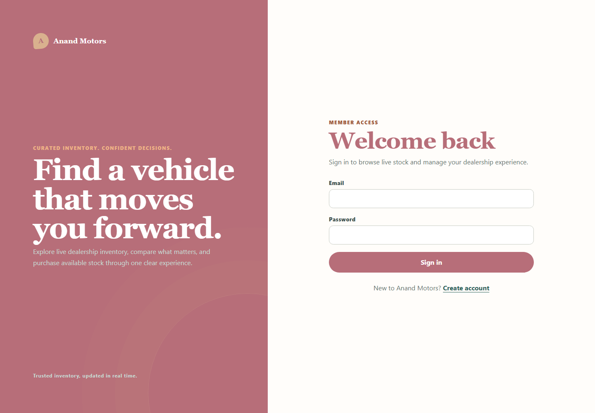
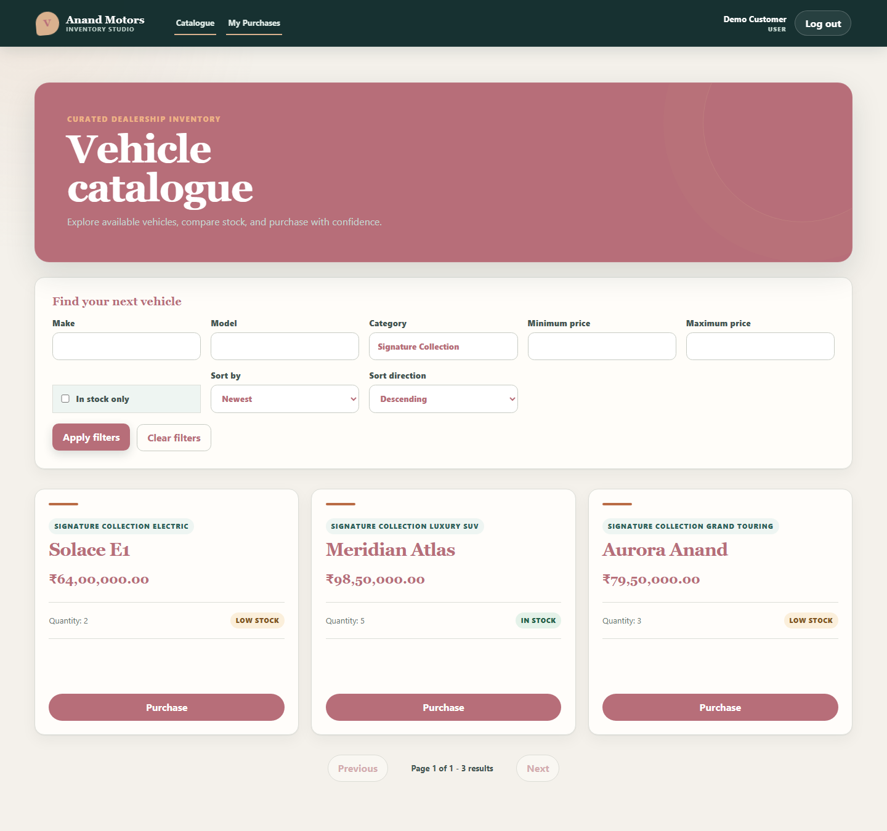
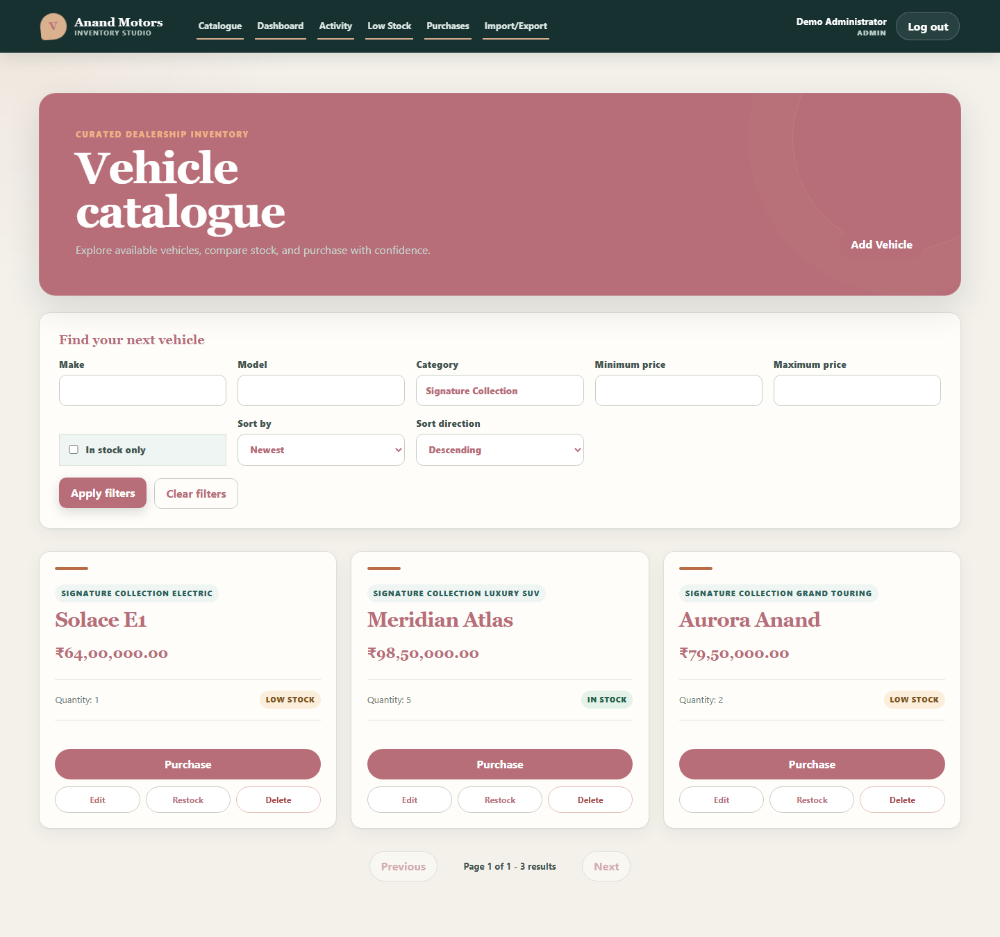
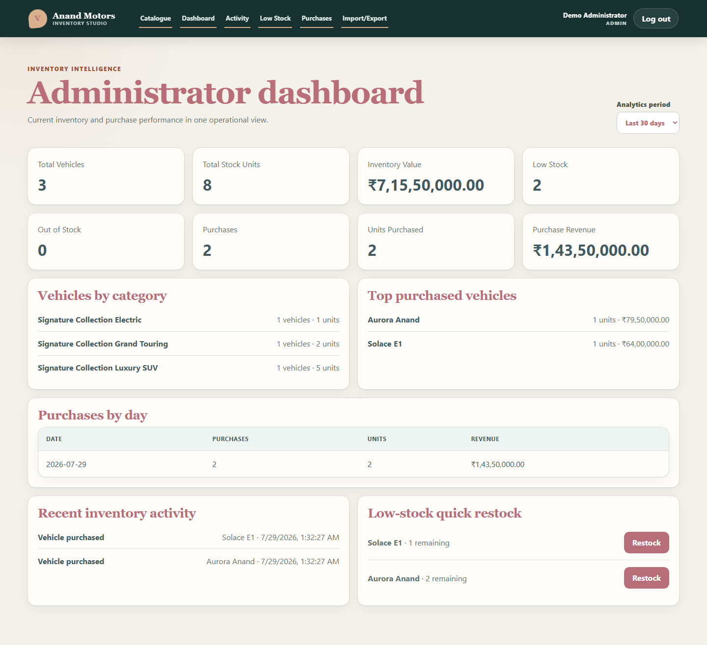
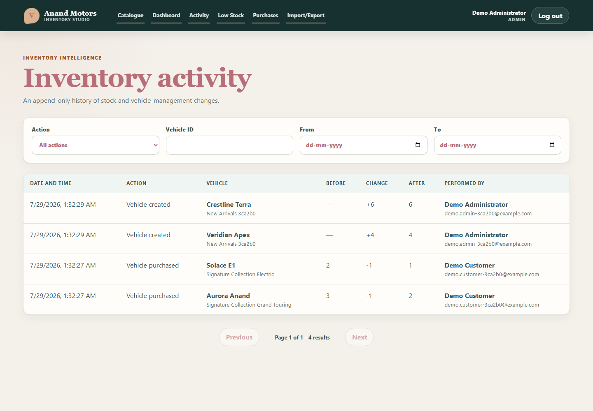
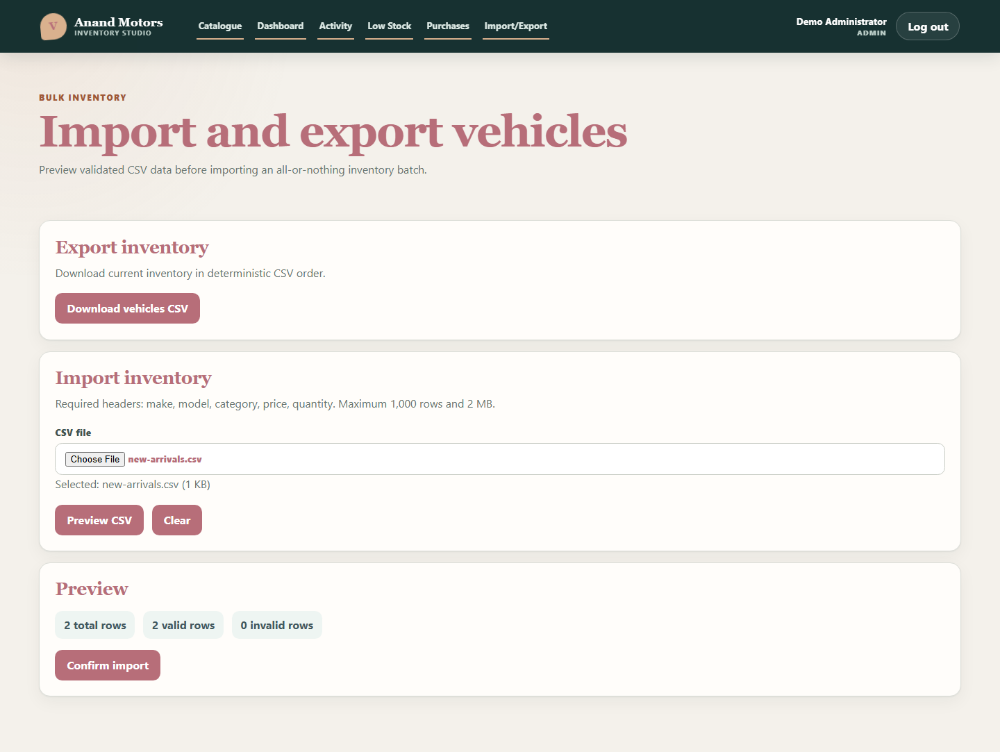
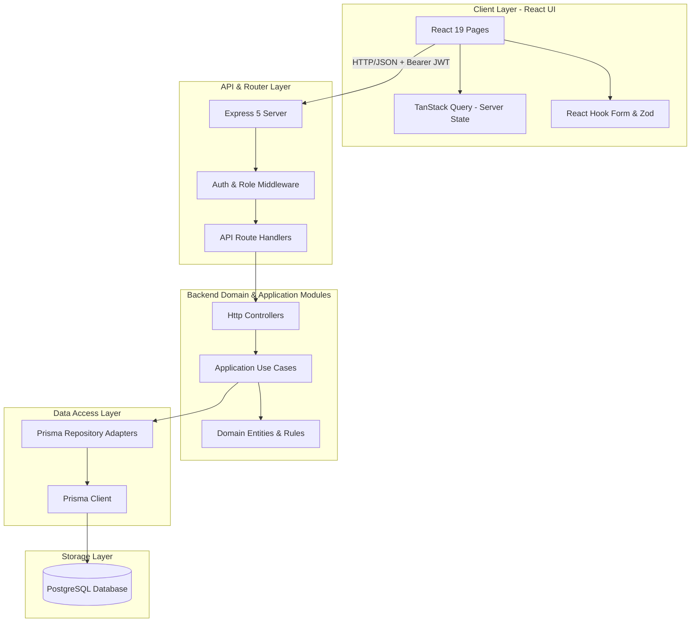
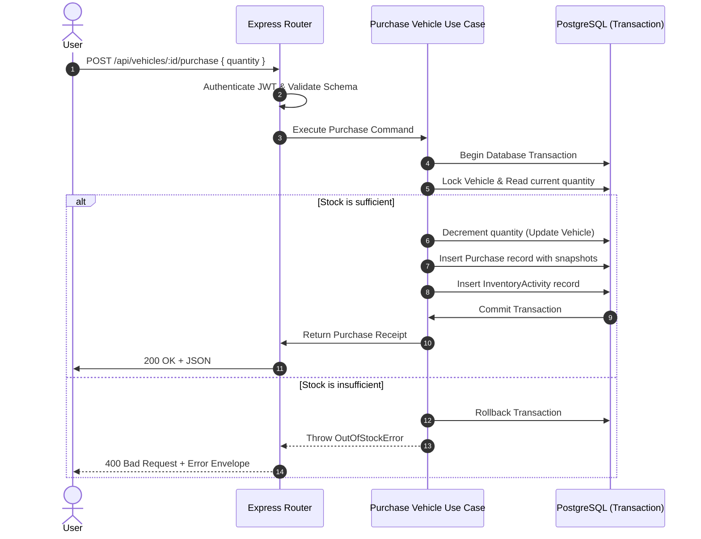
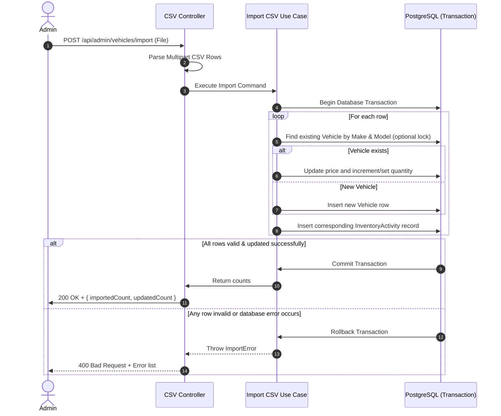

# Car Dealership Inventory System

[](https://github.com/Zala0007/Incubyte/actions/workflows/ci.yml)

A full-stack TypeScript application for browsing dealership inventory, purchasing vehicles, and managing stock. The core assignment is extended with auditing, reporting, monitoring, and CSV tools.

Please read the [Feature Guide](docs/FEATURE_GUIDE.md) for a detailed walkthrough.

---

## Key Application Screenshots

Below are screenshots of the primary user interfaces in the application. All views are fully responsive and styled for maximum clarity and aesthetic appeal.

### User Login Page

The entrance to the application. Authenticates users and issues JWT tokens determining their respective access roles (`USER` or `ADMIN`).


### Customer Catalogue Page

Allows customers (`USER` and `ADMIN`) to search, sort, and paginate through available vehicles. Displays real-time stock levels, pricing, and purchase controls.


### Administrator Inventory Page

Allows administrators (`ADMIN` role only) to add, update, delete, and restock vehicles. Includes shortcuts to CSV imports and exports.


### Administrator Dashboard (Analytics)

Provides visual and statistical summaries of total inventory values, low stock counts, revenue trends, and historic transactions.


### Inventory Activity Log

An append-only audit trail showing all inventory mutations (creations, edits, deletions, purchases, and restocks) along with the actor, time, and quantities.


### CSV Preview and Import

Enables transactional CSV batch imports. Admins can preview validation issues line-by-line before committing changes.


---

## System Architecture

The project is structured as an npm workspace containing decoupled frontend and backend modules written in TypeScript.



### Module Structure (Hexagonal Style)

Each feature on the backend follows a clean architecture pattern separating layers:

```text
module/
|-- application/      # Use cases, commands, queries, schema validations
|-- domain/           # Entities, value objects, exceptions, repository contracts
|-- http/             # Express routes, controllers, response formatting
|-- infrastructure/   # Prisma query and transaction adapters
|-- test-support/     # Test doubles, builders, and fixtures
`-- module.ts         # Dependency composition & wiring
```

### Database Schema (Prisma Models)

The schema maps 4 main models:

- **`User`**: Holds name, email, role (`USER` or `ADMIN`), and hashed passwords.
- **`Vehicle`**: Holds current make, model, category, price, and quantity.
- **`Purchase`**: Append-only transactional history of purchases. Holds vehicle snapshots to preserve integrity if the vehicle is deleted.
- **`InventoryActivity`**: Append-only audit history of every inventory change.

---

## 🔌 API Documentation & Endpoints

The API is fully documented using the [OpenAPI Contract](docs/api.yaml). All protected endpoints require an `Authorization: Bearer <JWT_TOKEN>` header.

### 1. Authentication (`/api/auth`)

- **`POST /api/auth/register`** (Public)
  - _Description_: Creates a new customer account with `USER` role.
  - _Request Body_: `{ name, email, password }`
  - _Response (201)_: `{ id, name, email, role }`
- **`POST /api/auth/login`** (Public)
  - _Description_: Authenticates credentials and returns a JWT.
  - _Request Body_: `{ email, password }`
  - _Response (200)_: `{ token, user: { id, name, email, role } }`

### 2. Vehicle Catalog (`/api/vehicles`)

- **`GET /api/vehicles`** (Authenticated)
  - _Description_: Retrieves a paginated list of vehicles.
  - _Query Parameters_: `page`, `limit`, `make`, `model`, `category`, `minPrice`, `maxPrice`, `available` (`true`/`false`), `sort` (`price_asc`, `price_desc`, `newest`)
  - _Response (200)_: `{ data: Vehicle[], pagination: { page, limit, total, totalPages } }`
- **`GET /api/vehicles/search`** (Authenticated)
  - _Description_: Autocomplete query search for vehicles.
  - _Query Parameters_: `q` (query string)
  - _Response (200)_: `Vehicle[]`
- **`POST /api/vehicles`** (Admin Only)
  - _Description_: Adds a new vehicle to the inventory.
  - _Request Body_: `{ make, model, category, price, quantity }`
  - _Response (201)_: `Vehicle`
- **`PUT /api/vehicles/:id`** (Admin Only)
  - _Description_: Updates vehicle attributes.
  - _Request Body_: `{ make, model, category, price, quantity }`
  - _Response (200)_: `Vehicle`
- **`DELETE /api/vehicles/:id`** (Admin Only)
  - _Description_: Soft deletes a vehicle from active catalog.
  - _Response (204)_: No Content
- **`POST /api/vehicles/:id/purchase`** (Authenticated)
  - _Description_: Purchases units of a vehicle.
  - _Request Body_: `{ quantity }`
  - _Response (200)_: `Purchase`
- **`POST /api/vehicles/:id/restock`** (Admin Only)
  - _Description_: Increments the quantity of a vehicle.
  - _Request Body_: `{ quantity }`
  - _Response (200)_: `Vehicle`

### 3. CSV Operations (`/api/admin/vehicles`)

- **`POST /api/admin/vehicles/import/preview`** (Admin Only)
  - _Description_: Validates a multipart CSV file and returns error rows and validation previews.
  - _Response (200)_: `{ validRows: parsedCSVRows[], errors: { row, column, message }[] }`
- **`POST /api/admin/vehicles/import`** (Admin Only)
  - _Description_: Runs a transactional batch import/upsert of vehicles.
  - _Response (200)_: `{ importedCount, updatedCount }`
- **`GET /api/admin/vehicles/export`** (Admin Only)
  - _Description_: Exports all vehicles to CSV format with formula-injection escaping.
  - _Response (200)_: CSV File stream

### 4. Admin Management & Logs

- **`GET /api/admin/vehicles/low-stock`** (Admin Only)
  - _Description_: Lists vehicles with stock counts below configured threshold.
  - _Response (200)_: `{ data: Vehicle[] }`
- **`GET /api/admin/inventory/activities`** (Admin Only)
  - _Description_: Paginated audit logs of all inventory events.
  - _Response (200)_: `{ data: InventoryActivity[], pagination }`
- **`GET /api/admin/purchases`** (Admin Only)
  - _Description_: Gets all historical purchases.
  - _Response (200)_: `{ data: Purchase[], pagination }`
- **`GET /api/purchases/me`** (Authenticated)
  - _Description_: Gets current logged-in user's purchases.
  - _Response (200)_: `{ data: Purchase[], pagination }`
- **`GET /api/admin/dashboard`** (Admin Only)
  - _Description_: Retrieves summary metrics and sales trends.
  - _Query Parameters_: `period` (`day`, `week`, `month`, `year`)
  - _Response (200)_: `{ stats: { totalValue, totalVehicles, totalStock, lowStockCount }, sales: { revenue, count, history: { date, count, revenue }[] } }`

---

## Transactional Dataflows

The system guarantees consistency using strict PostgreSQL transaction boundaries managed by Prisma.

### 1. Purchase Vehicle Flow

Ensures inventory is decremented atomic with purchase logs, preventing negative stock under high concurrency.



### 2. CSV Import Flow

Protects catalog sanity by batching CSV inserts/updates. Any single row failing validation rolls back all imports.



---
## My AI Usage

This project was developed with responsible use of AI-assisted software engineering tools. AI was used to accelerate development, improve code quality, and review implementation approaches, while all architectural decisions, business logic, testing, and final integration were performed manually.

### AI Tools Used

- **ChatGPT (GPT-5.5)**
- **Claude Sonnet 5**
- **GLM 5.2**
- **GitHub Copilot**

### How AI Was Used

AI assisted with:

- Brainstorming software architecture and Clean Architecture organization.
- Designing REST APIs, database schema, and Prisma models.
- Discussing implementation strategies for authentication, authorization, and inventory management.
- Generating initial boilerplate for React components, Express routes, and test cases.
- Debugging TypeScript, React, Prisma, and PostgreSQL issues.
- Reviewing code for readability, maintainability, and adherence to SOLID principles.
- Improving documentation, diagrams, and developer experience.

### Reflection

AI significantly accelerated repetitive development tasks and helped explore alternative implementation approaches. 

Every AI-generated suggestion was carefully reviewed, validated, modified where necessary, and integrated manually. 

All final architectural decisions, production code, testing strategy, and documentation reflect my own engineering judgment and responsibility.

## Prerequisites & Setup

### Prerequisites

- Node.js 20.19+ (within Node 20) or Node.js 22.12+
- npm 10+
- PostgreSQL
- Git

### Quick Start Guide

1.  **Clone the repository and enter the directory**:

    ```bash
    git clone <repository-url>
    cd Incubyte/Incubyte-main
    ```

2.  **Create the environment configuration file**:
    - _Windows PowerShell_:
      ```powershell
      Copy-Item .env.example .env
      ```
    - _macOS/Linux_:
      ```bash
      cp .env.example .env
      ```

3.  **Configure environment variables inside `.env`**:
    Configure variables, especially:
    - `DATABASE_URL`: PostgreSQL connection URL for development
    - `TEST_DATABASE_URL`: Separate database connection URL ending with `_test` for Vitest tests
    - `JWT_SECRET`: Random string of 32+ characters
    - `ADMIN_NAME`, `ADMIN_EMAIL`, `ADMIN_PASSWORD`: Administrator seed credentials

4.  **Install & Setup Database schema/seeds**:

    ```bash
    npm run setup
    ```

    _(Installs dependencies, runs Prisma database migrations, seeds the initial 50-car inventory and the admin account, and downloads browser binaries for testing)_

5.  **Run Development Servers**:
    ```bash
    npm run dev
    ```
    - Frontend: `http://localhost:5173`
    - Backend: `http://localhost:3000`

---

## Testing and Quality Control

The project achieves high confidence with passing unit, integration, and E2E visual/functional test specs.

- **Run all tests (frontend + backend)**:
  ```bash
  npm test
  ```
- **Run full-stack E2E tests (Playwright browser journeys)**:
  ```bash
  npm run test:e2e
  ```
- **Run complete workspace compliance check (linter, formatters, typescript compiler, test suites)**:
  ```bash
  npm run check
  ```

For detailed test summaries, refer to the [Test Report](docs/TEST_REPORT.md).

---

## Known Limitations

- **Sessions**: JWT access tokens are used directly. Slide/refresh session mechanisms, MFA, email verification, or password recovery features are not yet implemented.
- **Auditing**: Audit history logs are append-only. There is currently no administrative purge/archival mechanism.
- **E2E Testing**: Headless browser automation in Playwright is primarily target-optimized for Chromium.
