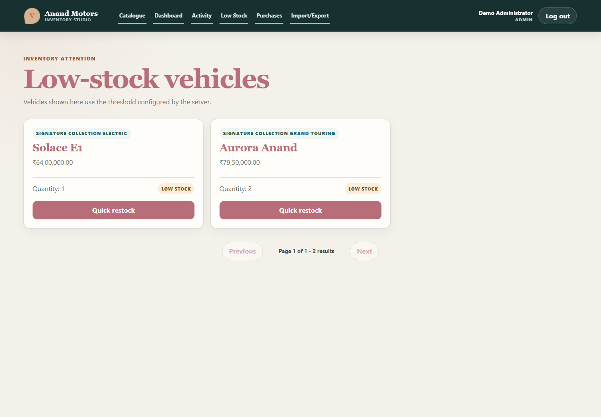
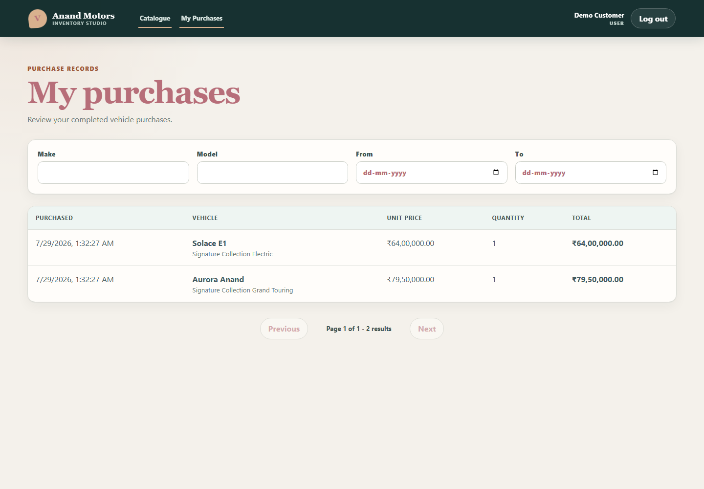
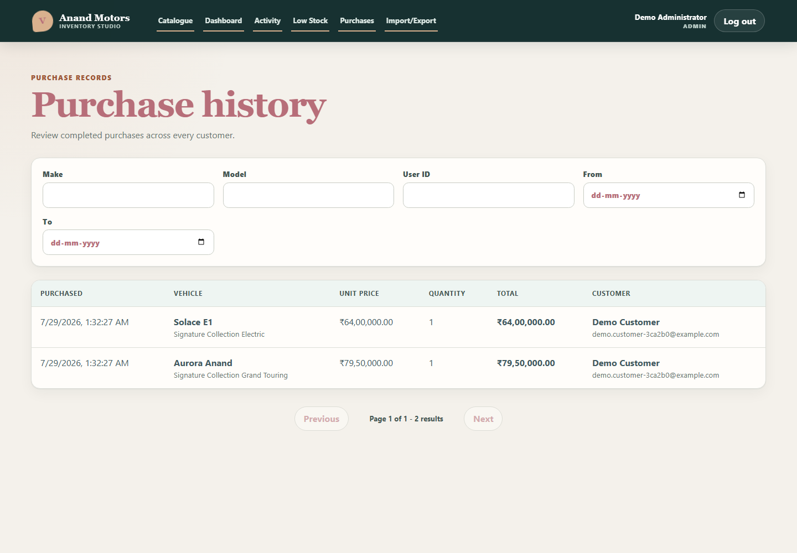

# Feature Guide

This guide separates the four assignment requirements from the additional features implemented to make the dealership system more complete.

## Assignment Features

### 1. Authentication

Users can register and log in through validated forms. Passwords are hashed with bcrypt, authentication uses expiring JWTs, and protected requests send the token through the authorization header.

Authorization is enforced twice:

- the frontend protects routes and hides unavailable actions;
- the backend verifies the token and role for every protected endpoint.

Public registration always creates a `USER`. The `ADMIN` role can be assigned only through the trusted seed command.

Tested behavior includes registration, login, duplicate email, password policy, password hashing, token creation, missing or invalid tokens, session restoration, logout, and role restrictions.


### 2. Vehicle CRUD

Administrators can:

- create a vehicle with make, model, category, price, and quantity;
- edit existing vehicle information;
- delete a vehicle after explicit confirmation;
- see success, validation, not-found, and server-error feedback.

The API validates all fields and rejects unknown properties. PostgreSQL constraints protect price and quantity invariants in addition to application validation.

Deleted vehicles are removed from active inventory, but their snapshots remain in purchase and activity history.


### 3. Search and Pagination

Authenticated users can search and filter inventory by:

- make;
- model;
- category;
- minimum and maximum price;
- in-stock availability.

Supported sort orders and page sizes are validated by the backend. Responses contain stable pagination metadata, and changing filters resets the browser to the first page.

The catalogue includes loading, empty, error, retry, and populated states.


### 4. Purchase and Restock

A purchase atomically decrements one available unit. When two requests compete for the final unit, only one succeeds and the other receives a safe stock-conflict response. Stock cannot become negative.

Each successful purchase writes:

- the stock change;
- an immutable purchase snapshot;
- an inventory activity record.

Administrators can atomically add a positive restock quantity. Successful stock mutations immediately refresh affected catalogue, low-stock, activity, purchase, and dashboard queries.

## Additional Features

The following functionality was added beyond the original assignment.

### Inventory Activity Log

Vehicle creation, update, deletion, purchase, restock, and CSV-created vehicles produce append-only activity records.

Each record contains:

- action;
- vehicle identity snapshot;
- actor attribution;
- previous quantity;
- quantity change;
- resulting quantity;
- timestamp.

Administrators can filter by action, vehicle, actor, and date. Vehicle snapshots remain available after deletion.


### Low-Stock Monitoring

The backend derives one of three stock states:

- `IN_STOCK`;
- `LOW_STOCK`;
- `OUT_OF_STOCK`.

The configured `LOW_STOCK_THRESHOLD` remains server-authoritative. Administrators receive a dedicated paginated low-stock view with quick-restock controls.



### Purchase History

Customers can review only their own purchases. Administrators can review purchases across all customers and filter by user, vehicle, and date.

Purchase records preserve vehicle name, category, unit price, quantity, and total amount. Historical information remains accurate after the live vehicle is edited or deleted.

| Customer history                                                    | Administrator history                                                     |
| ------------------------------------------------------------------- | ------------------------------------------------------------------------- |
|  |  |

### Administrator Analytics Dashboard

The dashboard combines current inventory and period-based sales information:

- vehicle count;
- total available units;
- exact inventory value;
- category distribution;
- low-stock and out-of-stock totals;
- purchase count and units;
- revenue;
- daily sales;
- top-selling vehicles;
- recent activity.

Administrators can select 7, 30, or 90-day purchase periods.


### CSV Import and Export

The import workflow accepts a `.csv` file with exactly these headers:

```csv
make,model,category,price,quantity
```

Preview parses and validates the file without writing to the database. Confirmation parses it again and imports every vehicle and activity in one transaction, or imports nothing.

Limits:

- maximum file size: 2 MB;
- maximum data rows: 1,000;
- strict headers and field validation.

Export produces deterministic inventory ordering, exact decimal formatting, correct CSV quoting, and spreadsheet-formula protection.


## User Experience

The interface provides:

- accessible labels and semantic controls;
- keyboard-friendly dialogs;
- visible focus treatment;
- loading, empty, success, error, retry, and conflict states;
- responsive navigation and page layouts;
- INR currency formatting;
- role-aware navigation and actions;
- immediate query refresh after mutations.

## Permission Summary

| Feature                      | USER | ADMIN |
| ---------------------------- | :--: | :---: |
| Register and log in          |  ✓   |   ✓   |
| Browse and search inventory  |  ✓   |   ✓   |
| Purchase vehicles            |  ✓   |   ✓   |
| View own purchases           |  ✓   |   ✓   |
| Manage and restock inventory |  —   |   ✓   |
| View activity records        |  —   |   ✓   |
| Monitor low stock            |  —   |   ✓   |
| Review all purchases         |  —   |   ✓   |
| View dashboard analytics     |  —   |   ✓   |
| Import and export CSV        |  —   |   ✓   |

Authorization is always enforced by the backend, regardless of frontend visibility.
